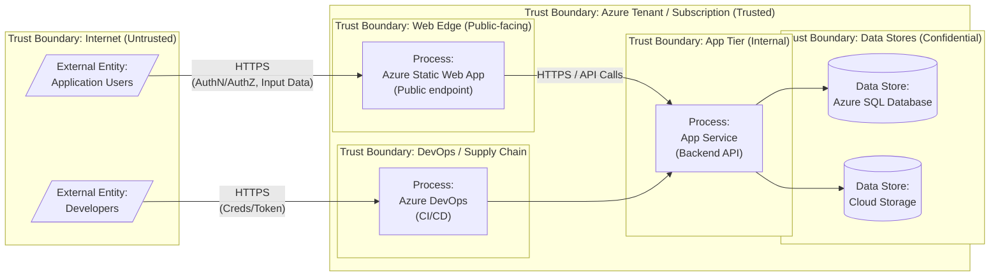

# Level up with GitHub Copilot for Security Compliance and Best Practices

## Objective

> Showcase what we can accomplish in security using all the latest features of GitHub Copilot.

## Official talk text

You already use GitHub Copilot to speed up development—but what if you could also write code according to your internal or industry security standards?

In this talk, we’ll show how to go beyond autocomplete, agent-mode, and leverage Copilot for security compliance and best practices. Whether your organization enforces strict standards or you need to align with frameworks like the OWASP Top 10, we’ll demonstrate how custom prompts, tailored instructions, and internal documentation can transform Copilot into a security ally without adding complexity.

In this session, our goal is to offer a practical, actionable approach on how to use the latest tools and capabilities of Copilot for security purposes.

## References
1. Worktrees, working with isolated changes and background agents
	1. https://code.visualstudio.com/updates/v1_107#_continue-tasks-in-background-or-cloud-agents
	1. https://code.visualstudio.com/docs/sourcecontrol/branches-worktrees#_working-with-git-worktrees
	1.  https://code.visualstudio.com/updates/v1_107#_adding-context-to-background-agents 
1. Subagents
	1. https://code.visualstudio.com/updates/v1_107#_run-agents-as-subagents-experimental
1. Agent skills
	1. https://code.visualstudio.com/updates/v1_108#_agent-skills-experimental
	1. https://code.visualstudio.com/docs/copilot/customization/agent-skills
	1. https://code.visualstudio.com/docs/copilot/customization/agent-skills#_agent-skills-vs-custom-instructions
1. Claude preview
	1. https://code.visualstudio.com/updates/v1_109#_claude-agent-preview
1. Agent orchestation (conductor + planning + implementation + code review)
	1. https://code.visualstudio.com/updates/v1_109#_agent-orchestration
	1. https://github.com/ShepAlderson/copilot-orchestra
1. Manage context window
	1. +Compact
	1. https://code.visualstudio.com/docs/copilot/chat/copilot-chat-context
1. Skills
	1. https://skills.sh
	1. https://github.com/anthropics/skills/blob/main/skills/skill-creator/SKILL.md
1. Awesome Copilot
	1. https://github.com/github/awesome-copilot
1. GitHub Agentic Workflows
	1. https://github.blog/ai-and-ml/automate-repository-tasks-with-github-agentic-workflows/
	1. https://github.github.com/gh-aw/
	1. https://github.github.com/gh-aw/blog/2026-01-13-meet-the-workflows-security-compliance/
	1. https://github.github.com/gh-aw/blog/2026-01-13-meet-the-workflows-documentation/

## Threat Model - Azure Architecture

### Diagrama STRIDE

